# Network and Security Lab

This project simulates a small Security and Network Operations Center environment running on my Ubuntu server at home. 
The lab monitors network traffic and system logs to detect suspicious activity.

## Tools Used
- UFW (Firewall)
- Snort (Network IDS)
- TCPdump (Packet capture)
- Python (log analysis scripts)

## Project Goal
The goal of this project is to gain practical experience in networking and cyber security

Through this project I have gained hands-on experience in:

- protocol knowledge
- intrusion detection
- log analysis
- attack simulation
- automated alert generation
________________________________________________________________

## TLS/HTTPS Web Server
I built and secured a web server on Ubuntu using Apache and HTTPS with TLS certificates. 
I configured networking components like DNS, port forwarding, and firewall rules to make the server accessible from the internet.

### Port Forwarding
To enable HTTPS using TLS, I first configured port forwarding on my router to direct incoming HTTP traffic (port 80) from my public IP address to my Ubuntu server.
This allowed Certbot to perform domain validation which verifies that I control the domain. Once validated, Certbot issued a TLS certificate from Let’s Encrypt. 
This certificate is required to enable HTTPS, which encrypts communication between clients and the web server.

In the screenshot below you can see the port forwarding rules I configured on my router to direct incoming HTTP traffic (port 80) from the internet to my Ubuntu server.

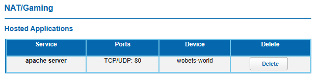

The reason we use port 80 (HTTP) rather than port 443 (HTTPS) is because Certbot utilizes HTTP. This allows Let's Encrypt to verify I have control of my domain before
issuing a TLS certificate

### Getting the Certificate
Now that Let's Encrypt has a path to my server through port 80, we can obtain the certificate from Certbot.

Why do I need Certbot? Certbot provides a TLS certificate from Let's Encrypt, which proves I control my servers domain. The certificate also allows my web server to use HTTPS.

To do this I first have to install Certbot and then run a simple command: *sudo certbot --apache*. This command requests a TLS certificate from Let's Encrypt, verifies domain ownership, 
and automatically configures Apache to use HTTPS.

### Troubleshooting Certificate Error
However, I experienced my first error when running this command.

"The Certificate Authority failed to verify the temporary Apache configuration changes made by Certbot. 
Ensure that the listed domains point to this Apache server and that it is accessible from the internet."

This error tells me Let's Encrypt cannot find my domain. But why? I just configured the port forwarding and my domain works in a browser. I could even access the site through its IP address.

To troubleshoot this issue I used *nslookup domain_name*

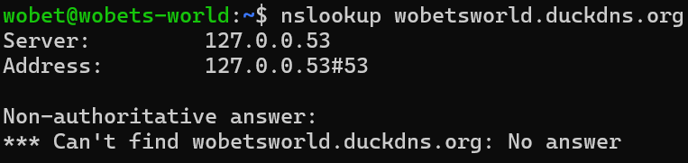

Running this command confirmed my problem. There must be an issue with my domain's IP address configuration since nslookup cannot find the URL.

After going over everything I'd done so far I finally realized, the IP address I set my domain name under was my private IP address rather than my public IP address.
This meant that any external traffic from the internet couldn't find my web server since private IP addresses are not accessible from external networks.
So, now I know that Certbot cannot validate my domain because it could not connect to my web server over port 80.

I use the command: *curl -4 ifconfig.me* to get my public IP address and set that as my web servers IP address. I then run *sudo certbot --apache* again.

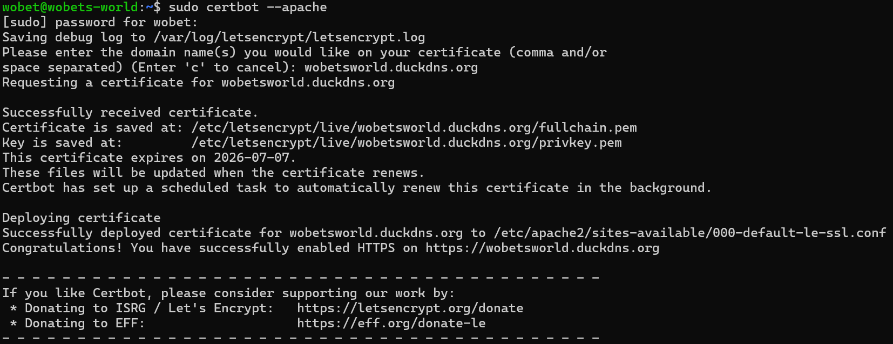

Now that we successfully have our certificate, we have proven we control the domain allowing the use of HTTPS to encrypt traffic between the client and the web server.

### Troubleshooting Error Reaching the Web Server
Not so fast!

We now have an issue reaching the website. How could obtaining the certificate affect connectivity?

Lets test again with the command *nslookup domain_name*.

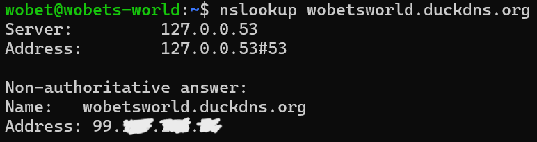

From this we can tell DNS is working properly, so why cant we access it?

What has changed between having the certificate and not having the certificate? Of course! The port we are using has changed.
Originally we were using HTTP (port 80) because we had to since we did not have to proper certificates to use HTTPS (port 443).
But now we must to use HTTPS since we are enforcing it.

First, lets fix the port forwarding rules on our router to include port 443.

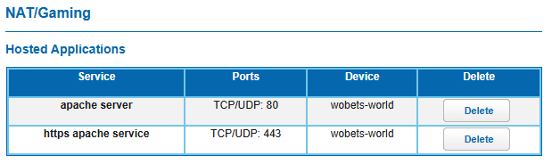

Now, external traffic through port 443 on my router will be forwarded to my web server.

I also know I must change the configurations on my UFW to allow port 443.

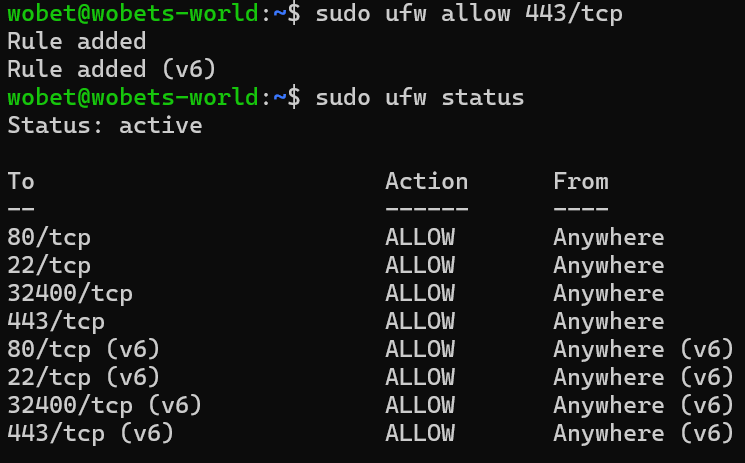

We can now try to access the web server once again.

It works! I am connected to my default Apache web server via HTTPS! I can now see my certificate.

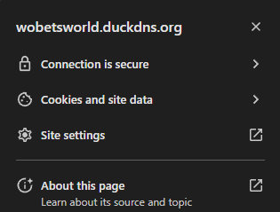

To confirm my web server is using HTTPS and the TLS handshake was successful I can run *curl -I domain_name*

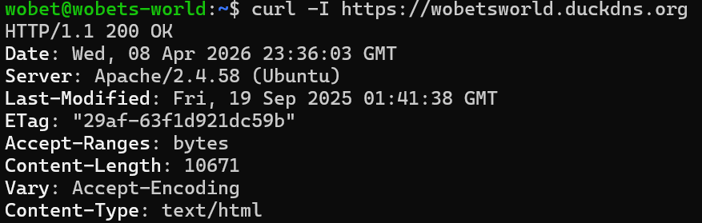

### What I Learned
From this project, I learned how to deploy and secure a web server using HTTPS and TLS. 
I gained hands-on experience with DNS, port forwarding, firewall configuration, and using obtaining and appling a TLS certificate.

________________________________________________________________

## SSH Brute Force Detector
This script, written in Python, is used to capture any failed SSH login attempts that could be interpreted as brute force attacks.

The script analyzes the '/var/log/auth.log' file for failed attempts, if there is a pattern of 5 or more failed login attempts from the same
IP address the IP address is flagged and added to 'soc_alerts.log'

### Brute Force Detection Code
This screenshot shows the code implemented onto my Ubuntu server.

Here I use a dictionary to store key-value pairs. If an IP address has a failed login attempt it is added to the 'failed_attempts' dictionary.
If the value exceeds 4 failed attempts the IP address is listed in the report.

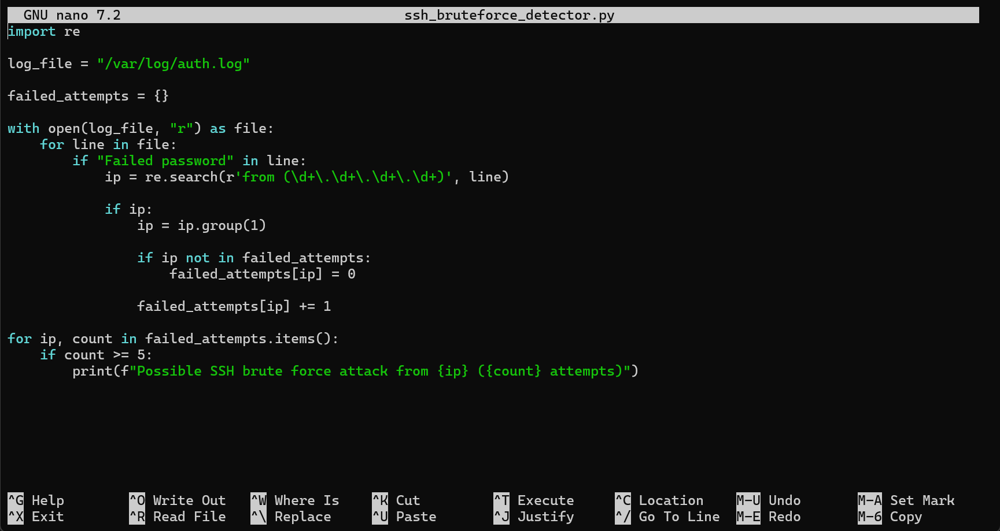

### Failed Entry and Failed Entry Detection
In the following screenshot I purposely used the incorrect password to SSH into my Ubuntu Server.

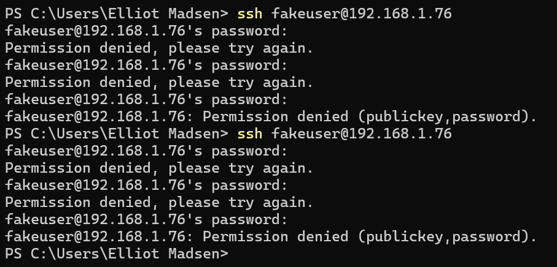

Here you can see my failed attempts were logged, along with another possible brute force attack from another test I ran.

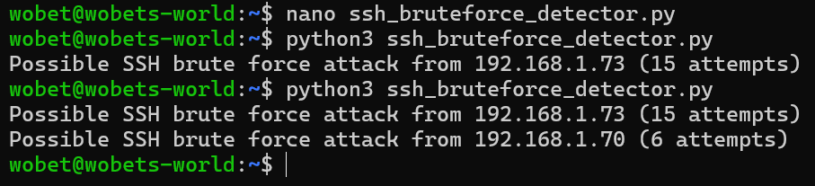

### Automating the Brute Force Detection Script
Finally, I used crontab to automate this system. Now, the script will run everyday at 2am and print results into soc_alerts.log.

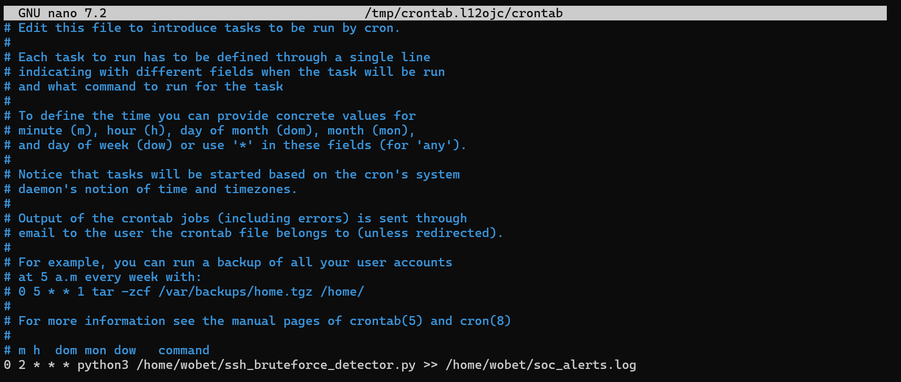

### What I Learned and How I can Improve the System
From this activity I have learned how to read log activity, produce a report, and log the report all automatically.
Like I said in the beginning of this README, my goal is to gain hands-on experience and come into the cyber world prepared for whatever I am asked.

The system could use some improvement. It would be nice to be able to get more information from the culprit than just their IP address.
I would also like an automated way of checking whether a threat is actually present. This would be listed in the report and each instance would flagged as urgent or low priority.

________________________________________________________________
